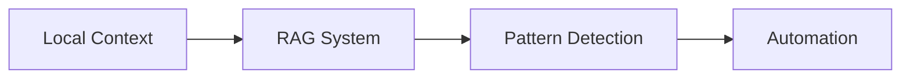
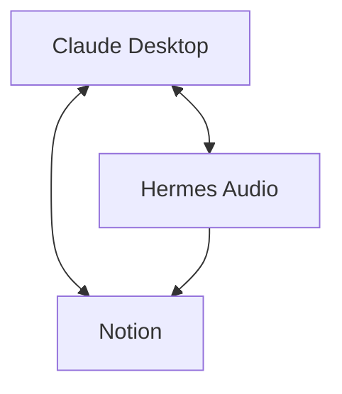

# 🎯 Demestihas AI Project Map
## Current State & Next Steps

---

## ✅ Completed Setup

### Project Structure Created
```
demestihas-ai/
│
├── 📁 claude-desktop/          ✅ Documents migrated
│   ├── COMPLETE_IMPLEMENTATION_PLAN.md
│   ├── IMPLEMENTATION_SUMMARY.md
│   ├── SUPABASE_RAG_ARCHITECTURE.md
│   ├── CLAUDE_TOOLS_REFERENCE.md
│   ├── ADAPTIVE_SYSTEM_DESIGN.md
│   └── ENHANCED_PROMPT_FRAMEWORK.md
│
├── 📁 hermes_audio/            ✅ Existing audio workflow
│   ├── docker-compose-hermes.yml
│   └── hermes_audio_processor.py
│
├── 📁 audio_workflow/          ✅ Current implementation
│   ├── workflow.py
│   ├── transcription_service.py
│   └── ai_analyzer.py
│
├── 📁 notion-automation/       🔵 Ready for development
│
├── 📁 shared-intelligence/     🔵 Ready for setup
│
└── 📄 README.md                ✅ Master documentation
```

---

## 🚀 Immediate Next Steps

### 1. Run Initialization Script
```bash
cd /Users/menedemestihas/Projects/demestihas-ai
chmod +x initialize.sh
./initialize.sh
```

This will:
- Complete directory structure
- Create package.json
- Set up configuration files
- Generate setup scripts

### 2. Install Dependencies
```bash
npm install
```

### 3. Configure Environment
```bash
cp .env.template .env
# Edit .env with your API keys:
# - Supabase URL & Keys
# - OpenAI API Key
# - Notion API Key
```

### 4. Set Up Supabase
```bash
# Run the interactive setup
npm run setup

# Or manually create tables using the schema from:
# claude-desktop/SUPABASE_RAG_ARCHITECTURE.md
```

---

## 📊 Development Phases

### Phase 1: Claude Desktop RAG (Week 1)
**Focus**: Memory & Learning System



**Tasks**:
- [ ] Set up Supabase tables
- [ ] Implement embedding pipeline
- [ ] Create context manager
- [ ] Build pattern detector
- [ ] Test RAG retrieval

### Phase 2: Integration (Week 2)
**Focus**: Connect Existing Systems



**Tasks**:
- [ ] Connect Hermes audio to Claude context
- [ ] Link audio transcriptions to RAG
- [ ] Create Notion task automation
- [ ] Build inter-agent messaging

### Phase 3: Automation (Week 3)
**Focus**: Workflows & Triggers

**Tasks**:
- [ ] Define core workflows
- [ ] Set up time-based triggers
- [ ] Create event-based automation
- [ ] Build pattern-based triggers

### Phase 4: Deployment (Week 4)
**Focus**: VPS Production Setup

**Tasks**:
- [ ] Dockerize all services
- [ ] Configure nginx proxy
- [ ] Set up monitoring
- [ ] Deploy to VPS

---

## 🔗 Component Integration Map

### Current Audio Workflow → Enhanced System
```yaml
Current:
  audio_workflow/:
    - Processes audio files
    - Generates transcriptions
    - Creates summaries

Enhancement:
  + Store transcriptions in RAG
  + Extract patterns from meetings
  + Auto-create Notion tasks
  + Build meeting intelligence
```

### Claude Desktop → Everything
```yaml
Claude as Hub:
  Inputs:
    - Hermes audio summaries
    - Notion task status
    - Email context
    - Calendar events
    
  Outputs:
    - Automated workflows
    - Task creation
    - Documentation
    - Pattern suggestions
```

---

## 🎯 Quick Wins (Do Today)

### 1. Test Current Audio Workflow
```bash
# Ensure audio workflow is functioning
cd audio_workflow
python workflow.py
```

### 2. Create User Profile
```bash
# After running initialize.sh
npm run configure-profile
```

### 3. Test Supabase Connection
```bash
# After setting up .env
npm run test-rag
```

### 4. Enable First Pattern
Create your first pattern:
```yaml
# claude-desktop/patterns/daily-standup.yaml
name: daily_standup
trigger: "morning routine"
steps:
  - tool: list_gcal_events
  - tool: search_gmail_messages
  - tool: git:git_status
output: standup-summary.md
```

---

## 📈 Success Metrics

### Week 1 Goals
- ✅ RAG storing all interactions
- ✅ Context retrieval working
- ✅ First pattern detected

### Week 2 Goals
- ✅ Audio → RAG pipeline
- ✅ Notion task creation
- ✅ Cross-agent communication

### Week 3 Goals
- ✅ 5+ automated workflows
- ✅ Pattern library growing
- ✅ Proactive suggestions

### Week 4 Goals
- ✅ Deployed to VPS
- ✅ Team access enabled
- ✅ Monitoring active

---

## 🛠️ Development Commands

### Daily Development
```bash
# Start enhanced Claude Desktop
npm run start-enhanced

# Run in development mode
npm run dev

# Check system health
npm run health-check

# View diagnostics
npm run diagnose
```

### Feature Toggling
```bash
# Enable/disable features
npm run enable-rag
npm run enable-patterns
npm run enable-automation
```

### Testing
```bash
# Run tests
npm test

# Test specific component
npm test claude-desktop
npm test hermes-audio
```

---

## 📚 Key Documentation

### For Implementation
1. [Complete Plan](./claude-desktop/COMPLETE_IMPLEMENTATION_PLAN.md) - Full technical details
2. [Quick Start](./claude-desktop/IMPLEMENTATION_SUMMARY.md) - Get running fast
3. [RAG Setup](./claude-desktop/SUPABASE_RAG_ARCHITECTURE.md) - Memory system

### For Reference
1. [Tool List](./claude-desktop/CLAUDE_TOOLS_REFERENCE.md) - All available tools
2. [System Design](./claude-desktop/ADAPTIVE_SYSTEM_DESIGN.md) - Architecture vision
3. [Prompt Framework](./claude-desktop/ENHANCED_PROMPT_FRAMEWORK.md) - Enhancement strategy

---

## 🎉 Vision Checkpoint

**Where we are**: Multiple separate tools working independently
**Where we're going**: Unified AI ecosystem with shared intelligence
**Next milestone**: Claude Desktop with perfect memory (1 week)
**Ultimate goal**: Self-improving system deployed on VPS (1 month)

---

## 🚦 Ready to Start?

1. **Run** `./initialize.sh`
2. **Configure** your API keys
3. **Test** the connections
4. **Build** the future

---

*Every line of code brings us closer to an AI that truly understands and grows with you.*
