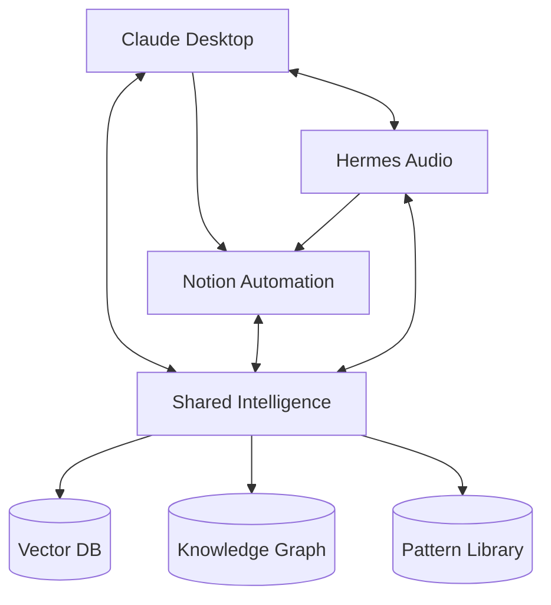

# Demestihas AI Suite
## Multi-Agent Custom AI Ecosystem

---

## 🎯 Vision
A comprehensive, intelligent AI ecosystem that combines multiple specialized agents into a unified system that learns, adapts, and automates across all aspects of digital work.

---

## 🏗️ Project Structure

```
demestihas-ai/
│
├── 🧠 claude-desktop/          # Enhanced Claude Desktop with RAG
│   ├── docs/                   # Implementation plans & architecture
│   ├── src/                    # Core enhancement code
│   ├── patterns/               # Reusable workflows & automations
│   └── config/                 # User profiles & settings
│
├── 📝 notion-automation/        # Notion Task Management Agent
│   ├── workflows/              # Task automation workflows
│   ├── templates/              # Project & task templates
│   └── integrations/           # Cross-platform connectors
│
├── 🎙️ hermes_audio/            # Meeting & Audio Intelligence
│   ├── transcription/          # Audio-to-text processing
│   ├── meeting-notes/          # Automated meeting summaries
│   ├── action-items/           # Task extraction from meetings
│   └── integrations/           # Calendar & communication tools
│
├── 🔗 shared-intelligence/     # Cross-Agent Learning & Memory
│   ├── knowledge-base/         # Shared semantic memory (Supabase)
│   ├── patterns/               # Cross-project patterns
│   ├── embeddings/             # Vector storage & RAG
│   └── team-learning/          # Collaborative intelligence
│
├── 🚀 deployment/               # VPS Deployment Configuration
│   ├── docker/                 # Container configurations
│   ├── nginx/                  # Reverse proxy setup
│   ├── monitoring/             # System health & metrics
│   └── backup/                 # Data persistence & recovery
│
└── 🔧 core-infrastructure/     # Shared Services
    ├── supabase/               # Vector DB & persistence
    ├── redis/                  # Caching layer
    ├── message-queue/          # Inter-agent communication
    └── api-gateway/            # Unified API interface
```

---

## 📦 Agent Modules

### 1. Claude Desktop Enhancement
**Status**: 🟡 In Development
**Purpose**: Transform Claude into an intelligent, learning assistant with perfect memory

**Key Features**:
- ✅ Semantic memory via Supabase RAG
- ✅ Pattern detection & automation
- ✅ Cross-session context retention
- ✅ Proactive suggestions & workflows

**Documentation**:
- [Complete Implementation Plan](./claude-desktop/COMPLETE_IMPLEMENTATION_PLAN.md)
- [Implementation Summary](./claude-desktop/IMPLEMENTATION_SUMMARY.md)
- [RAG Architecture](./claude-desktop/SUPABASE_RAG_ARCHITECTURE.md)

---

### 2. Notion Task Automation
**Status**: 🔵 Planned
**Purpose**: Intelligent task management and project coordination

**Planned Features**:
- Automatic task creation from conversations
- Smart prioritization based on context
- Cross-project dependency tracking
- Team workload balancing
- Meeting action item extraction

**Integration Points**:
- Claude Desktop → Task creation
- Hermes Audio → Meeting tasks
- Shared Intelligence → Priority learning

---

### 3. Hermes Audio Intelligence
**Status**: 🟡 In Development
**Purpose**: Transform meetings and audio into actionable intelligence

**Key Features**:
- Real-time transcription
- Speaker identification
- Action item extraction
- Automated meeting summaries
- Decision tracking

**Integration Points**:
- Notion → Task creation from meetings
- Claude Desktop → Context for follow-ups
- Shared Intelligence → Meeting patterns

---

### 4. Shared Intelligence Layer
**Status**: 🔵 Planned
**Purpose**: Enable cross-agent learning and team knowledge sharing

**Core Components**:
- **Vector Database**: Centralized Supabase instance
- **Pattern Library**: Shared successful workflows
- **Team Learning**: Collaborative intelligence
- **Knowledge Graph**: Connected insights across agents

---

## 🔄 Inter-Agent Communication



### Message Flow Examples

#### Example 1: Meeting to Tasks
```
1. Hermes transcribes meeting
2. Extracts action items
3. Sends to Notion for task creation
4. Claude gets context for follow-up
5. Pattern stored in Shared Intelligence
```

#### Example 2: Error Resolution
```
1. Claude encounters error
2. Searches Shared Intelligence
3. Finds solution from past incident
4. Applies fix automatically
5. Updates pattern success rate
```

#### Example 3: Project Planning
```
1. Claude analyzes requirements
2. Notion creates project structure
3. Hermes schedules planning meetings
4. Shared Intelligence suggests similar project patterns
```

---

## 🚀 Deployment Strategy

### Phase 1: Local Development (Current)
- Individual agents running locally
- File-based communication
- SQLite for quick prototyping

### Phase 2: Unified Local System
- Docker Compose orchestration
- Shared Supabase instance
- Redis for caching
- Local API gateway

### Phase 3: VPS Deployment
- Production Supabase
- Kubernetes orchestration
- Load balancing
- Monitoring & alerting

### Phase 4: Team Scaling
- Multi-tenant architecture
- Role-based access control
- Team knowledge sharing
- Enterprise integrations

---

## 🛠️ Technology Stack

### Core Technologies
- **Runtime**: Node.js, Python
- **Vector DB**: Supabase with pgvector
- **Embeddings**: OpenAI text-embedding-3
- **Cache**: Redis
- **Queue**: RabbitMQ / Redis Queue
- **API**: Express.js / FastAPI

### Agent-Specific
- **Claude Desktop**: JavaScript, Electron APIs
- **Notion**: Notion API, REST
- **Hermes**: Whisper, Python audio libs

### Infrastructure
- **Container**: Docker
- **Orchestration**: Kubernetes
- **Proxy**: Nginx
- **Monitoring**: Prometheus + Grafana

---

## 📊 Success Metrics

### System Health
```yaml
performance:
  api_response_time: < 200ms
  embedding_generation: < 500ms
  pattern_matching: < 100ms
  cache_hit_rate: > 80%

reliability:
  uptime: > 99.9%
  data_durability: 100%
  backup_frequency: hourly
  recovery_time: < 5min
```

### Intelligence Metrics
```yaml
learning:
  patterns_detected: > 50/week
  automation_rate: > 40%
  accuracy_improvement: > 5%/month
  knowledge_growth: > 100 items/day

collaboration:
  shared_patterns: > 20/week
  cross_agent_insights: > 10/day
  team_knowledge_reuse: > 60%
```

---

## 🔐 Security & Privacy

### Data Protection
- End-to-end encryption for sensitive data
- Row-level security in Supabase
- API key rotation
- Audit logging

### Access Control
- OAuth 2.0 authentication
- Role-based permissions
- Team isolation
- Data residency options

---

## 📚 Documentation

### Getting Started
1. [System Requirements](./docs/requirements.md)
2. [Quick Start Guide](./docs/quickstart.md)
3. [Configuration](./docs/configuration.md)

### Development
1. [Architecture Overview](./docs/architecture.md)
2. [API Reference](./docs/api.md)
3. [Contributing Guide](./docs/contributing.md)

### Agent Guides
1. [Claude Desktop Setup](./claude-desktop/IMPLEMENTATION_SUMMARY.md)
2. [Notion Automation](./notion-automation/README.md)
3. [Hermes Audio](./hermes_audio/README.md)

---

## 🎯 Roadmap

### Q1 2025
- [x] Claude Desktop RAG implementation
- [ ] Notion basic automation
- [ ] Hermes transcription pipeline
- [ ] Shared Intelligence v1

### Q2 2025
- [ ] Inter-agent communication
- [ ] Team knowledge sharing
- [ ] VPS deployment
- [ ] Monitoring dashboard

### Q3 2025
- [ ] Advanced pattern learning
- [ ] Predictive automation
- [ ] Mobile interfaces
- [ ] Plugin ecosystem

### Q4 2025
- [ ] Enterprise features
- [ ] Multi-tenant support
- [ ] Advanced analytics
- [ ] AI model fine-tuning

---

## 🤝 Contributing

We welcome contributions! See [CONTRIBUTING.md](./CONTRIBUTING.md) for guidelines.

### Current Priorities
1. Claude Desktop enhancements
2. Supabase schema optimization
3. Pattern detection algorithms
4. Documentation improvements

---

## 📧 Contact

**Project Lead**: Mene Demestihas
**Repository**: github.com/menedemestihas/demestihas-ai
**Status Updates**: [Project Board]

---

## 📄 License

This project is proprietary software. All rights reserved.

---

*Building intelligence that grows with you.*
