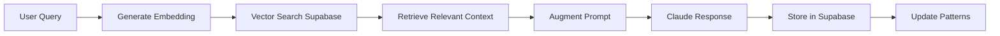

# Claude Desktop + Supabase RAG Architecture

## Overview
Integrating Supabase with Claude Desktop enables true Retrieval-Augmented Generation (RAG), creating a persistent, intelligent memory system that grows more powerful over time.

## Core Architecture

### 1. **Vector Memory System**
```sql
-- Supabase schema with pgvector
CREATE TABLE memories (
  id UUID PRIMARY KEY DEFAULT gen_random_uuid(),
  content TEXT,
  embedding vector(1536),
  metadata JSONB,
  created_at TIMESTAMP DEFAULT NOW(),
  session_id UUID,
  project_id TEXT,
  tool_chain TEXT[],
  success_score FLOAT
);

CREATE TABLE patterns (
  id UUID PRIMARY KEY DEFAULT gen_random_uuid(),
  pattern_type TEXT, -- 'workflow', 'preference', 'error_recovery'
  trigger_context TEXT,
  action_sequence JSONB,
  usage_count INTEGER DEFAULT 0,
  success_rate FLOAT,
  embedding vector(1536)
);

CREATE TABLE knowledge_base (
  id UUID PRIMARY KEY DEFAULT gen_random_uuid(),
  doc_type TEXT, -- 'project', 'domain', 'reference'
  title TEXT,
  content TEXT,
  embedding vector(1536),
  metadata JSONB,
  last_accessed TIMESTAMP,
  relevance_score FLOAT
);
```

### 2. **RAG Pipeline**



## Implementation Strategy

### Phase 1: Semantic Memory
```javascript
// Store every interaction with embeddings
async function storeMemory(interaction) {
  const embedding = await generateEmbedding(interaction.query);
  
  await supabase.from('memories').insert({
    content: interaction.query,
    embedding,
    metadata: {
      response: interaction.response,
      tools_used: interaction.tools,
      timestamp: new Date(),
      session_id: getCurrentSession(),
      project: detectProject(interaction)
    }
  });
}

// Retrieve relevant context for new queries
async function getRelevantContext(query, limit = 10) {
  const embedding = await generateEmbedding(query);
  
  const { data } = await supabase.rpc('match_memories', {
    query_embedding: embedding,
    match_threshold: 0.7,
    match_count: limit
  });
  
  return data;
}
```

### Phase 2: Pattern Learning
```javascript
// Detect and store patterns
async function detectPatterns(interactions) {
  const patterns = analyzeWorkflows(interactions);
  
  for (const pattern of patterns) {
    await supabase.from('patterns').upsert({
      pattern_type: pattern.type,
      trigger_context: pattern.trigger,
      action_sequence: pattern.actions,
      embedding: await generateEmbedding(pattern.description)
    });
  }
}

// Match current context to patterns
async function suggestPatterns(currentContext) {
  const embedding = await generateEmbedding(currentContext);
  
  const { data } = await supabase.rpc('match_patterns', {
    context_embedding: embedding,
    threshold: 0.8
  });
  
  return data;
}
```

### Phase 3: Knowledge Accumulation
```javascript
// Build persistent knowledge base
async function updateKnowledgeBase(document) {
  const chunks = splitIntoChunks(document.content);
  
  for (const chunk of chunks) {
    await supabase.from('knowledge_base').insert({
      doc_type: document.type,
      title: document.title,
      content: chunk.text,
      embedding: await generateEmbedding(chunk.text),
      metadata: {
        source: document.source,
        project: document.project,
        tags: extractTags(chunk.text)
      }
    });
  }
}
```

## RAG-Enabled Capabilities

### 1. **Contextual Awareness**
```yaml
Before responding:
  1. Embed user query
  2. Retrieve top-10 similar past interactions
  3. Retrieve relevant project documentation
  4. Identify applicable patterns
  5. Augment response with this context
```

### 2. **Proactive Suggestions**
```yaml
Continuous monitoring:
  - Detect when current work matches past patterns
  - Suggest relevant automations
  - Recommend similar solutions from history
  - Predict next likely actions
```

### 3. **Learning Feedback Loop**
```yaml
After each interaction:
  1. Store interaction with embedding
  2. Update pattern usage statistics
  3. Adjust relevance scores
  4. Retrain pattern matching thresholds
```

## Advanced RAG Features

### Temporal Context
```sql
-- Get context from specific time periods
CREATE FUNCTION get_temporal_context(
  query_embedding vector,
  start_date timestamp,
  end_date timestamp
) RETURNS TABLE(...) AS $$
  SELECT * FROM memories
  WHERE created_at BETWEEN start_date AND end_date
  ORDER BY embedding <=> query_embedding
  LIMIT 20;
$$ LANGUAGE sql;
```

### Project-Specific RAG
```sql
-- Retrieve context only from current project
CREATE FUNCTION get_project_context(
  query_embedding vector,
  project_id text
) RETURNS TABLE(...) AS $$
  SELECT * FROM memories
  WHERE metadata->>'project' = project_id
  ORDER BY embedding <=> query_embedding
  LIMIT 20;
$$ LANGUAGE sql;
```

### Cross-Project Learning
```sql
-- Find similar patterns across projects
CREATE FUNCTION find_similar_solutions(
  problem_embedding vector
) RETURNS TABLE(...) AS $$
  SELECT DISTINCT ON (solution_pattern)
    solution_pattern,
    project,
    success_rate
  FROM patterns
  WHERE pattern_type = 'solution'
  ORDER BY embedding <=> problem_embedding
  LIMIT 5;
$$ LANGUAGE sql;
```

## Supabase Real-time Features

### Live Collaboration
```javascript
// Subscribe to team knowledge updates
supabase
  .channel('team-knowledge')
  .on('postgres_changes', {
    event: 'INSERT',
    schema: 'public',
    table: 'knowledge_base'
  }, (payload) => {
    // Instantly aware of new team documentation
    updateLocalContext(payload.new);
  })
  .subscribe();
```

### Pattern Sharing
```javascript
// Share successful patterns with team
async function sharePattern(pattern) {
  await supabase.from('shared_patterns').insert({
    ...pattern,
    author: getCurrentUser(),
    team_id: getTeamId(),
    visibility: 'team'
  });
}
```

## Implementation Benefits

### Immediate Gains
- **Perfect Recall**: Never lose context from past sessions
- **Semantic Search**: Find relevant information by meaning, not keywords
- **Pattern Recognition**: Automatically identify and reuse successful workflows

### Progressive Enhancement
- **Growing Intelligence**: Every interaction makes future ones smarter
- **Team Learning**: Share patterns and knowledge across team
- **Predictive Assistance**: Anticipate needs based on historical patterns

### Long-term Value
- **Institutional Memory**: Preserve all project knowledge
- **Workflow Evolution**: Continuously optimize based on outcomes
- **Personalized AI**: Deeply understand individual work patterns

## Practical Examples

### Example 1: Project Context
```
User: "Continue working on the audio workflow"

RAG Process:
1. Embed "audio workflow"
2. Retrieve all past audio workflow interactions
3. Get latest project files and git status
4. Identify common patterns from past sessions
5. Response includes full context without asking
```

### Example 2: Error Recovery
```
User: "I'm getting that Docker error again"

RAG Process:
1. Embed error description
2. Find similar past errors
3. Retrieve successful solutions
4. Check if solution pattern exists
5. Apply known fix automatically
```

### Example 3: Knowledge Query
```
User: "What did we decide about the API structure?"

RAG Process:
1. Embed query
2. Search all stored decisions
3. Find relevant meeting notes
4. Retrieve code comments
5. Synthesize comprehensive answer
```

## Setup Requirements

### Supabase Configuration
```javascript
// Initialize Supabase client
import { createClient } from '@supabase/supabase-js';

const supabase = createClient(
  process.env.SUPABASE_URL,
  process.env.SUPABASE_ANON_KEY
);

// Enable pgvector extension
await supabase.rpc('enable_pgvector');

// Create vector similarity search function
await supabase.rpc('create_similarity_search', {
  table_name: 'memories',
  embedding_column: 'embedding',
  match_threshold: 0.7
});
```

### Embedding Generation
```javascript
// Use OpenAI or local embedding model
async function generateEmbedding(text) {
  // Option 1: OpenAI
  const response = await openai.embeddings.create({
    model: "text-embedding-3-small",
    input: text
  });
  return response.data[0].embedding;
  
  // Option 2: Local model via Ollama
  // const response = await ollama.embeddings({
  //   model: 'nomic-embed-text',
  //   prompt: text
  // });
  // return response.embedding;
}
```

## Privacy & Security

### Data Segregation
```sql
-- Row Level Security for personal data
ALTER TABLE memories ENABLE ROW LEVEL SECURITY;

CREATE POLICY "Users can only see own memories"
  ON memories FOR SELECT
  USING (auth.uid() = user_id);

CREATE POLICY "Teams can share project memories"
  ON memories FOR SELECT
  USING (project_id IN (
    SELECT project_id FROM team_projects
    WHERE team_id = auth.jwt()->>'team_id'
  ));
```

### Encryption
```javascript
// Encrypt sensitive content before storage
const encryptedContent = await encrypt(sensitiveData, userKey);
await supabase.from('memories').insert({
  content: encryptedContent,
  encrypted: true,
  // ... other fields
});
```

## Performance Optimization

### Indexing Strategy
```sql
-- Optimize vector searches
CREATE INDEX memories_embedding_idx 
  ON memories USING ivfflat (embedding vector_cosine_ops)
  WITH (lists = 100);

-- Speed up temporal queries
CREATE INDEX memories_time_idx 
  ON memories(created_at DESC);

-- Accelerate project filtering
CREATE INDEX memories_project_idx 
  ON memories((metadata->>'project'));
```

### Caching Layer
```javascript
// Local cache for frequently accessed patterns
const patternCache = new Map();

async function getCachedPattern(trigger) {
  if (patternCache.has(trigger)) {
    return patternCache.get(trigger);
  }
  
  const pattern = await fetchPatternFromSupabase(trigger);
  patternCache.set(trigger, pattern);
  
  // Refresh cache periodically
  setTimeout(() => patternCache.delete(trigger), 3600000);
  
  return pattern;
}
```

## Migration Path

### Step 1: Basic Setup
- Create Supabase project
- Enable pgvector
- Create initial tables
- Set up embedding pipeline

### Step 2: Start Collecting
- Store all interactions
- Begin pattern detection
- Build initial knowledge base

### Step 3: Enable RAG
- Implement similarity search
- Add context retrieval
- Augment prompts

### Step 4: Advanced Features
- Real-time collaboration
- Cross-project learning
- Predictive assistance

## Success Metrics

### Quantitative
- Query-to-context match rate
- Pattern reuse frequency
- Time saved through automation
- Reduction in repeated questions

### Qualitative
- Context relevance quality
- Pattern accuracy
- User satisfaction scores
- Knowledge retention rate

## The Ultimate Vision

With Supabase + RAG, Claude Desktop becomes:
- **Omniscient**: Perfect recall of all past interactions
- **Predictive**: Anticipates needs before they're expressed
- **Collaborative**: Learns from entire team's experience
- **Evolutionary**: Continuously improving through usage

---
*This architecture transforms Claude Desktop from a stateless assistant into an intelligent system with perfect memory and continuous learning capabilities.*