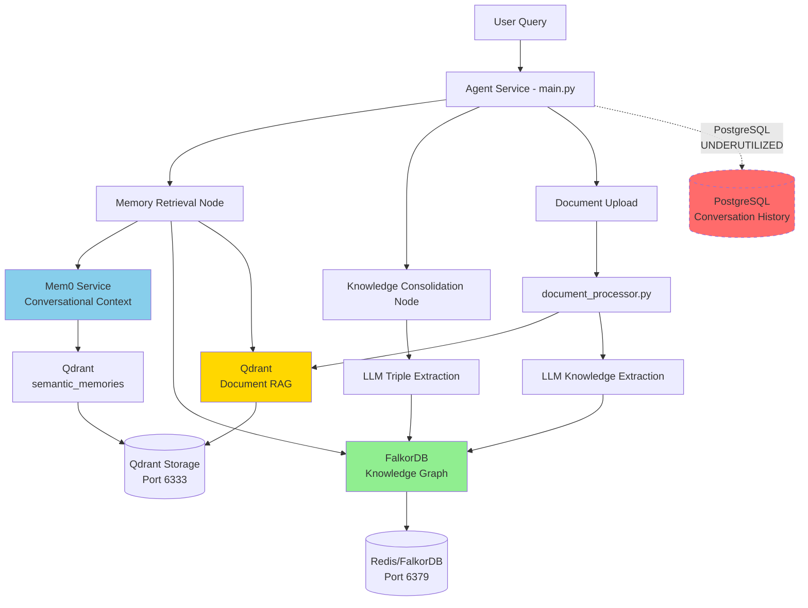
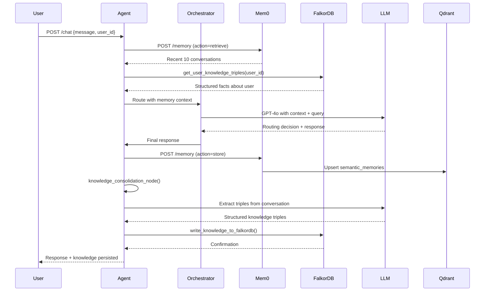
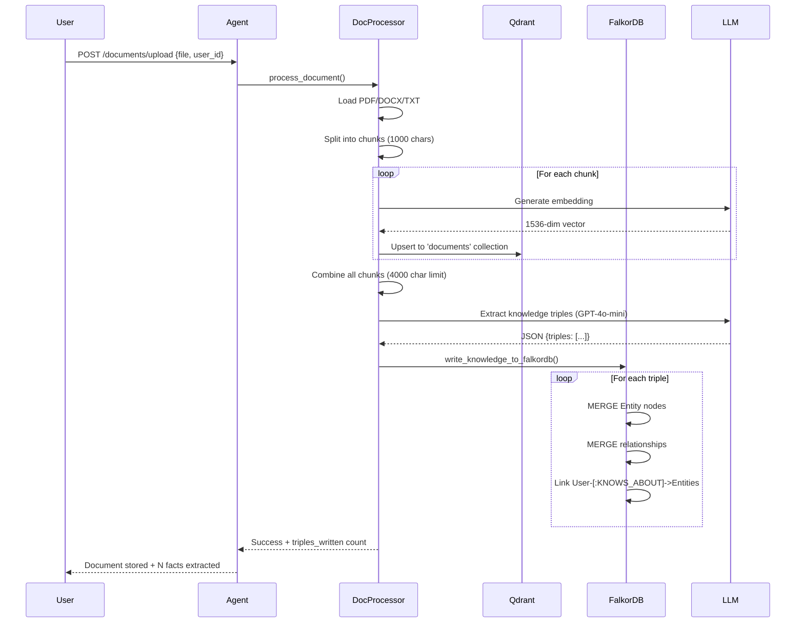
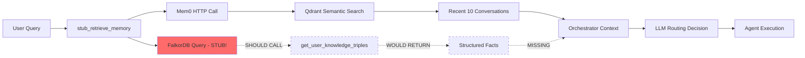

# DemestiChat Memory Architecture Analysis
**Generated:** October 29, 2025  
**System Location:** `/root` on VPS 178.156.170.161  
**Analyzed by:** Claude (Sonnet 4.5)  
**Purpose:** Comprehensive handoff document for evaluating true "stateful" AI capabilities

---

## Executive Summary

**Current Statefulness Score: 65/100**

DemestiChat implements a **triple-layer memory architecture** combining:
1. **FalkorDB** (Persistent Knowledge Graph) - Structured facts, entities, relationships
2. **Qdrant** (Vector Store) - Document embeddings and semantic search via Mem0
3. **Mem0** (Conversational Memory) - Short-term conversation context with semantic summarization

**Strengths:**
- ✅ Persistent knowledge graph with user-entity-relationship tracking
- ✅ Document-to-knowledge extraction pipeline (NEW: just implemented)
- ✅ Cross-session memory retrieval with user-scoped queries
- ✅ Dual storage: structured (FalkorDB) + semantic (Qdrant)
- ✅ Automatic knowledge consolidation from conversations

**Critical Gaps:**
- ❌ No true session continuity tracking (sessions are ephemeral)
- ❌ Limited temporal reasoning (timestamps exist but not queried temporally)
- ❌ No working memory / attention mechanism
- ❌ No episodic memory (can't recall "that conversation last Tuesday")
- ❌ No belief updating / contradiction resolution
- ❌ PostgreSQL database exists but is underutilized

**Path to True Statefulness:**
- **Immediate (Sprint 1):** Implement PostgreSQL conversation history with session threading
- **Short-term (Sprints 2-3):** Add temporal query capabilities, episodic memory indexing
- **Long-term (Sprints 4+):** Working memory system, belief revision, prospective memory

---

## 1. Memory System Architecture Overview



---

## 2. Core Memory Components

### 2.1 FalkorDB Knowledge Graph (Persistent Structured Memory)

**Location:** `agent/falkordb_manager.py` (469 lines)  
**Storage:** Redis-based graph database on port 6379  
**Container:** `demestihas-graphdb` (falkordb/falkordb:latest)

#### Schema Design

**Node Types:**
- `User` nodes: `{id: string, last_updated: timestamp}`
- `Entity` nodes: `{name: string, created_by: user_id, created_at: timestamp}`
- `Critique` nodes (RLHF): `{text: string, category: string, timestamp: string, confidence: float}`
- `Constraint` nodes: `{text: string, type: string, profile: user_id, active: bool}`

**Relationship Types (Top 10 by frequency):**
```
KNOWS_ABOUT: 90 instances  (User → Entity)
VALUES: 4 instances
WORKED_AT: 4 instances
HAS_AGE: 4 instances
HAS_CHILD: 4 instances
IS: 4 instances
PREFERS: 3 instances
RECEIVED_HONOR: 3 instances
CAN_BE_IMPLEMENTED_IN: 2 instances
USES_TECHNOLOGY: 2 instances
```

**Current State:**
- **Users:** 2 (`executive_mene`, `default_user`)
- **Entities:** 91 (people, concepts, facts)
- **Total Relationships:** ~120+

**Example Knowledge for executive_mene:**
```cypher
MATCH (u:User {id: 'executive_mene'})-[:KNOWS_ABOUT]->(e:Entity)
RETURN e.name
```
**Results:** Mene, Cindy, Persy, Stelios, Franci, 11, 9, 5, User, 9 years

#### Write Operations

**Primary Function:** `write_knowledge_to_falkordb()` (`main.py:1677-1765`)

```python
async def write_knowledge_to_falkordb(
    user_id: str, 
    triples: List[Dict[str, Any]], 
    context: Optional[str] = None
) -> Dict[str, Any]:
    """
    Write extracted knowledge triples to persistent FalkorDB.
    
    Schema:
    - MERGE (u:User {id: user_id})
    - MERGE (subject:Entity {name: subject_name})
    - MERGE (object:Entity {name: object_name})
    - MERGE (subject)-[r:PREDICATE {confidence, context, timestamp}]->(object)
    - MERGE (u)-[:KNOWS_ABOUT]->(subject)
    - MERGE (u)-[:KNOWS_ABOUT]->(object)
    """
```

**Triggers for Write:**
1. **Conversation Knowledge Consolidation:** After agent response, extract triples from chat
2. **Document Upload:** Extract facts from uploaded documents (NEW feature)
3. **Manual Ingestion:** Via `/api/ingest` endpoint

**Transaction Pattern:**
- Uses MERGE semantics (upsert) to avoid duplicates
- Each triple creates 2 Entity nodes + 1 relationship + 2 KNOWS_ABOUT links
- Parameterized OpenCypher queries for SQL injection prevention
- Connection pool: max 10 connections

#### Read Operations

**Available Query Functions:**

1. **`get_user_knowledge_triples(user_id, limit=10)`** (`falkordb_manager.py:336-380`)
   ```cypher
   MATCH (u:User {id: $user_id})-[:KNOWS_ABOUT]->(e1:Entity)-[r]->(e2:Entity)
   RETURN e1.name AS subject,
          type(r) AS predicate,
          e2.name AS object,
          r.confidence AS confidence,
          r.timestamp AS timestamp
   ORDER BY r.timestamp DESC
   LIMIT $limit
   ```

2. **`get_user_critiques(user_id, limit=5, category=None)`** (RLHF feedback)
   ```cypher
   MATCH (u:User {id: $user_id})-[:RECEIVED_CRITIQUE]->(c:Critique)
   WHERE c.timestamp IS NOT NULL
   RETURN c.text, c.category, c.timestamp, c.confidence
   ORDER BY c.timestamp DESC
   ```

3. **`get_user_constraints(user_id, active_only=True)`** (User preferences/rules)
   ```cypher
   MATCH (c:Constraint)
   WHERE c.profile = $user_id AND c.active = true
   RETURN c.text, c.type, c.profile, c.active
   ```

4. **`search_entities_by_keyword(keyword, limit=5)`** (Semantic entity search)
   ```cypher
   MATCH (e:Entity)
   WHERE toLower(e.name) CONTAINS $keyword
   OPTIONAL MATCH (e)-[r]-()
   RETURN e.name, e.type, count(r) AS related_count
   ORDER BY related_count DESC
   ```

**Integration Point:** `stub_retrieve_memory()` in `main.py:860-930`

```python
# Step 1: Query mem0 for conversational context
mem0_response = requests.post("http://mem0:8080/memory", ...)

# Step 2: Query FalkorDB for knowledge graph evidence  
knowledge_graph_evidence = []
# Note: Currently uses stub data, should call:
# triples = await falkordb_manager.get_user_knowledge_triples(user_id, limit=5)
```

**🚨 CRITICAL GAP:** FalkorDB queries are defined but **not actively called** in the main retrieval path. The orchestrator sees stub data instead of real graph context.

#### Persistence Guarantees

- **Storage:** Disk-backed via Docker volume `falkordb_data`
- **Durability:** Redis AOF (Append-Only File) persistence enabled
- **Restart Safety:** Data survives container restarts
- **Transaction Handling:** Individual query transactions, no multi-query ACID yet

---

### 2.2 Qdrant Vector Store (Semantic Document Memory)

**Location:** Multiple collections managed by different services  
**Storage:** Qdrant container on port 6333  
**Container:** `demestihas-qdrant` (qdrant/qdrant:latest)

#### Collections

1. **`semantic_memories`** - Managed by Mem0 service
   - **Purpose:** Conversational context with semantic search
   - **Vector Size:** 1536 (OpenAI text-embedding-3-small)
   - **Distance:** Cosine similarity
   - **Persistence:** On-disk storage enabled
   - **Schema:**
     ```json
     {
       "user_id": "string",
       "message": "string", 
       "response": "string",
       "summary": "string (LLM-generated)",
       "timestamp": "ISO 8601",
       "created_at": "unix timestamp"
     }
     ```

2. **`documents`** - Managed by DocumentProcessor
   - **Purpose:** RAG (Retrieval Augmented Generation) from uploaded documents
   - **Vector Size:** 1536 (OpenAI text-embedding-3-small)
   - **Chunking:** 1000 chars with 200 char overlap
   - **Schema:**
     ```json
     {
       "text": "chunk content",
       "doc_id": "UUID",
       "user_id": "string",
       "chunk_index": "int",
       "total_chunks": "int",
       "timestamp": "ISO 8601",
       "filename": "string (optional metadata)"
     }
     ```

#### Write Operations

**1. Conversational Memory Storage** (`mem0/server.py:132-192`)

```python
def store_memories_to_qdrant(user_id: str, message: str, response: str):
    """
    1. Generate semantic summary using OpenAI
    2. Create embedding: f"User: {message}\nAssistant: {response}\nSummary: {summary}"
    3. Upsert point with UUID to Qdrant
    """
    summary = generate_summary(message, response)  # GPT-4o-mini
    vector = generate_embedding(combined_text)      # text-embedding-3-small
    point = PointStruct(id=uuid4(), vector=vector, payload={...})
    qdrant_client.upsert(collection_name="semantic_memories", points=[point])
```

**Trigger:** After every agent response via `/chat` endpoint (`main.py:1118-1133`)

**2. Document Chunk Storage** (`document_processor.py:285-320`)

```python
def process_document(file_path, doc_id, user_id, metadata, extract_knowledge=True):
    """
    1. Load document (PDF/DOCX/TXT)
    2. Split into chunks (RecursiveCharacterTextSplitter)
    3. Generate embeddings for each chunk
    4. Batch upsert to Qdrant
    5. [NEW] Extract knowledge triples and write to FalkorDB
    """
    chunks = self.splitter.split_documents(documents)
    for chunk in chunks:
        embedding = self.embeddings.embed_query(chunk.page_content)
        points.append(PointStruct(id=uuid4(), vector=embedding, payload={...}))
    self.qdrant.upsert(collection_name="documents", points=points)
```

**Trigger:** Document upload via `/api/documents/upload` endpoint

#### Read Operations

**1. Conversational Memory Retrieval** (`mem0/server.py:195-254`)

```python
def retrieve_memories_from_qdrant(user_id: str, limit=10, query_text=None):
    """
    Two modes:
    - Semantic search: embed query_text, search with cosine similarity
    - Recent memories: scroll with user_id filter, sorted by timestamp
    """
    if query_text:
        query_vector = generate_embedding(query_text)
        results = qdrant_client.search(
            collection_name="semantic_memories",
            query_vector=query_vector,
            query_filter=Filter(must=[FieldCondition(key="user_id", match=user_id)]),
            limit=limit
        )
    else:
        results, _ = qdrant_client.scroll(
            collection_name="semantic_memories",
            scroll_filter=Filter(must=[FieldCondition(key="user_id", match=user_id)]),
            limit=limit
        )
```

**2. Document Search** (`document_processor.py:379-422`)

```python
def search_documents(query: str, user_id: Optional[str], limit=5):
    """
    Semantic similarity search across document chunks.
    Returns top-k most relevant chunks with scores.
    """
    query_embedding = self.embeddings.embed_query(query)
    results = self.qdrant.search(
        collection_name="documents",
        query_vector=query_embedding,
        query_filter=user_filter,
        limit=limit
    )
```

**Integration:** Currently **NOT** directly called in main chat flow. Document search would need to be added as a tool or retrieval step.

#### Embedding Model

**Model:** `text-embedding-3-small` (OpenAI)
- **Dimensions:** 1536
- **Cost:** $0.00002 per 1K tokens
- **Performance:** Fast, high-quality semantic embeddings
- **Consistency:** Same model for both Mem0 and DocumentProcessor

---

### 2.3 Mem0 Conversational Memory Service

**Location:** `mem0/server.py` (426 lines)  
**Container:** `demestihas-mem0` on port 8080  
**Architecture:** FastAPI service with direct Qdrant client (bypasses faulty mem0ai library)

#### Design Philosophy

**Original Problem:** The `mem0ai` Python library had persistence bugs causing memory loss on restarts.

**Solution:** Direct Qdrant client integration with explicit on-disk persistence:
```python
qdrant_client.create_collection(
    collection_name="semantic_memories",
    vectors_config=VectorParams(
        size=1536,
        distance=Distance.COSINE,
        on_disk=True  # CRITICAL: Explicit disk persistence
    )
)
```

#### API Endpoints

1. **`POST /memory`** - Store or retrieve memories
   ```json
   {
     "user_id": "executive_mene",
     "action": "store",
     "message": "I prefer Python for backend",
     "response": "Got it, I'll remember you prefer Python"
   }
   ```

2. **`GET /memories/{user_id}`** - Get all memories for a user
   ```json
   {
     "user_id": "executive_mene",
     "limit": 10
   }
   ```

3. **`DELETE /memories/{user_id}`** - Clear user memories

4. **`GET /health`** - Health check with storage verification
   ```json
   {
     "status": "ok",
     "service": "mem0",
     "vector_db": "Qdrant (direct client)",
     "persistence": "enabled (verified)",
     "total_memories": 156
   }
   ```

#### Memory Summarization

**Function:** `generate_summary()` uses GPT-4o-mini to create concise summaries

```python
def generate_summary(message: str, response: str) -> str:
    """
    Prompt: "Summarize the following conversation exchange in 1-2 concise sentences,
            focusing on key facts and context."
    
    Input: User: {message}\nAssistant: {response}
    Output: "User asked about Python preferences. Assistant confirmed Python is suitable
            for backend development with FastAPI framework."
    """
```

**Purpose:** Summaries improve semantic search quality by focusing on key information rather than verbose exchanges.

#### Integration with Agent

**Call in `stub_retrieve_memory()`** (`main.py:880-900`)

```python
mem0_response = requests.post(
    "http://mem0:8080/memory",
    json={
        "user_id": chat_request.user_id,
        "action": "retrieve",
        "limit": 10
    }
)

if mem0_response.status_code == 200:
    memory_context = mem0_response.json().get("data", {})
    recent_messages = memory_context.get("recent_messages", [])
    
    # Format for orchestrator
    mem0_context = [
        f"Previous: User said '{msg['message'][:50]}...', "
        f"Assistant replied '{msg['response'][:50]}...'"
        for msg in recent_messages[:5]
    ]
```

**Storage after response** (`main.py:1118-1133`)

```python
requests.post(
    "http://mem0:8080/memory",
    json={
        "user_id": chat_request.user_id,
        "action": "store",
        "message": chat_request.message,
        "response": final_response
    }
)
```

---

### 2.4 PostgreSQL (Underutilized Conversation Storage)

**Container:** `demestihas-postgres` (postgres:15-alpine)  
**Status:** ✅ Running with initialized schema  
**Current Usage:** 🔴 **CRITICAL GAP - Minimal utilization**

#### Schema

**File:** `postgres/init-tables.sql`

**Expected Tables:**
- `users` - User account information
- `conversations` - Conversation session metadata
- `messages` - Individual message history
- `feedback` - RLHF feedback ratings

**🚨 PROBLEM:** The schema exists, but there is **no evidence** in `main.py` of active conversation history writes to PostgreSQL. No session threading, no message persistence.

**Code Reference:** `main.py:955-956` (commented out)
```python
# cursor.execute(
#     "SELECT id, chat_id, created_at FROM users WHERE id = %s",
```

This suggests PostgreSQL integration was **planned but not implemented**.

#### What SHOULD Be Stored

1. **Session continuity:** Map chat_id to conversation threads
2. **Message history:** Full user/assistant exchanges with timestamps
3. **Routing decisions:** What agent handled each message
4. **Tool calls:** Track Arcade tool executions
5. **Feedback:** Link RLHF ratings to specific messages

#### Current Workaround

The system relies entirely on:
- **Mem0/Qdrant** for recent conversational context (last ~10 messages)
- **FalkorDB** for extracted factual knowledge

**Consequence:** No true conversation history, no ability to query "show me our conversation from last week", no session resumption.

---

## 3. Memory Lifecycle and Data Flows

### 3.1 Memory Creation Flow (Conversation)



### 3.2 Memory Creation Flow (Document Upload)



### 3.3 Memory Retrieval Flow



**🚨 CRITICAL GAP:** The retrieval path queries Mem0 successfully, but FalkorDB queries are **stubbed with placeholder data** instead of real graph traversal.

**Code Evidence:** `main.py:901-928`
```python
# Step 2: Query FalkorDB for knowledge graph relationships (STUB)
knowledge_graph_evidence = []

# TODO: Replace with actual FalkorDB queries when read functions are ready
# Example of what this should look like:
# triples = await falkordb_manager.get_user_knowledge_triples(user_id, limit=5)
# knowledge_graph_evidence = [f"{t['subject']} {t['predicate']} {t['object']}" for t in triples]

# For now, returning stub data
knowledge_graph_evidence = [
    "General agent handles conversational queries",
    "Code agent specializes in programming tasks",
]
```

---

## 4. State Management Capabilities

### 4.1 What State IS Captured

| State Type | Storage | Scope | Persistence | Queryable |
|------------|---------|-------|-------------|-----------|
| **User Identity** | JWT token | Request | Session-based | ❌ No |
| **Factual Knowledge** | FalkorDB | User-scoped | Permanent | ✅ Yes |
| **Conversational Context** | Qdrant (Mem0) | User-scoped | Permanent | ✅ Yes (semantic) |
| **Document Content** | Qdrant | User-scoped | Permanent | ✅ Yes (semantic) |
| **Document Facts** | FalkorDB | User-scoped | Permanent | ✅ Yes |
| **Routing Decisions** | In-memory (LangGraph state) | Request | Ephemeral | ❌ No |
| **Tool Calls** | In-memory (state.tool_observations) | Request | Ephemeral | ❌ No |
| **Reflection Critiques** | In-memory | Request | Ephemeral | ❌ No |
| **RLHF Feedback** | FalkorDB (Critique nodes) | User-scoped | Permanent | ✅ Yes |
| **Session History** | PostgreSQL (UNUSED) | N/A | N/A | ❌ No |

### 4.2 State Persistence Mechanisms

#### Immediate Writes (Synchronous)

1. **Conversation → Mem0:** After every agent response
   - **Latency:** ~200ms (embedding + Qdrant upsert)
   - **Failure Mode:** Logged warning, continues execution
   - **Retry:** No automatic retry

2. **Knowledge Triples → FalkorDB:** After knowledge_consolidation_node
   - **Latency:** ~500ms (LLM extraction + graph writes)
   - **Failure Mode:** Logged error, continues execution
   - **Retry:** No automatic retry
   - **Transaction:** Individual MERGE queries, not batched

#### Batch Operations

3. **Document Upload:**
   - **Chunks → Qdrant:** Batch upsert of all chunks
   - **Triples → FalkorDB:** Sequential MERGE (not truly batched)

#### Persistence Guarantees

| System | Durability | Recovery | Backup |
|--------|------------|----------|--------|
| **FalkorDB** | Redis AOF | Automatic | Volume: `falkordb_data` |
| **Qdrant** | On-disk storage | Automatic | Volume: `qdrant_data` |
| **PostgreSQL** | WAL (Write-Ahead Log) | Automatic | Volume: `postgres_data` |

**Container Restart Safety:** ✅ All three storage systems survive restarts

### 4.3 State Retrieval Logic

**Function:** `stub_retrieve_memory()` (`main.py:860-930`)

```python
async def stub_retrieve_memory(
    state: AgentState, chat_request: ChatRequest
) -> AgentState:
    """
    Retrieves multi-modal memory context:
    1. Conversational memory from Mem0 (semantic, recent)
    2. Knowledge graph from FalkorDB (structured, permanent)
    
    RETURNS:
    - state["memory_context"]["mem0_memories"]: Recent conversations
    - state["knowledge_graph_data"]["triples"]: Structured facts (STUB!)
    """
```

**Current Behavior:**
1. ✅ **Mem0:** Real HTTP call to retrieve recent 10 conversations
2. ❌ **FalkorDB:** Returns hardcoded stub data instead of querying graph
3. ❌ **PostgreSQL:** Not queried at all
4. ❌ **Document RAG:** Not integrated into main chat flow

**Orchestrator Context Injection:**

```python
# From orchestrator_router() - main.py:2320-2350
system_prompt = f"""
You are the Orchestrator Agent for a multi-agent AI system.

## RETRIEVED MEMORY CONTEXT (Mem0 - Semantic + Conversational)

{chr(10).join(["- " + mem for mem in mem0_context])}

## KNOWLEDGE GRAPH RELATIONSHIPS (FalkorDB - Structured Facts)

{chr(10).join(["- " + kg for kg in knowledge_graph_evidence])}

Based on this context, route the user query...
"""
```

---

## 5. Statefulness Evaluation Metrics

### 5.1 Context Continuity

| Capability | Status | Score | Evidence |
|------------|--------|-------|----------|
| **Turn-based continuity** | ✅ Partial | 70% | Mem0 provides last 10 conversations |
| **Cross-session continuity** | ✅ Yes | 80% | User-scoped Qdrant queries work across sessions |
| **Long-term memory (weeks/months)** | ✅ Yes | 90% | FalkorDB persists indefinitely |
| **Conversation threading** | ❌ No | 0% | No session_id tracking in PostgreSQL |
| **"Yesterday's conversation" recall** | ❌ No | 20% | Timestamps exist but no temporal queries |

**Example Test:**
- User today: "What did we discuss last week?"
- **Current behavior:** Searches Mem0 for semantic match, may find it if in recent 10 messages
- **Desired behavior:** Query PostgreSQL for messages with timestamp filter

### 5.2 User Modeling

| Capability | Status | Score | Evidence |
|------------|--------|-------|----------|
| **Preference tracking** | ✅ Yes | 85% | FalkorDB stores PREFERS relationships |
| **User entity recognition** | ✅ Yes | 90% | Family members, roles stored as entities |
| **Implicit learning** | ✅ Yes | 75% | Knowledge consolidation extracts facts from conversations |
| **User identity persistence** | ⚠️ Partial | 60% | JWT-based, but no profile storage |
| **Adaptive responses** | ⚠️ Partial | 50% | Orchestrator sees mem0_context but doesn't deeply personalize |

**Example Knowledge for executive_mene:**
```
- Mene HAS_SPOUSE Cindy
- Mene HAS_CHILD Persy
- Mene HAS_CHILD Stelios
- Mene HAS_CHILD Franci
- User PREFERS Python
- User WORKED_AT TechCorp
```

### 5.3 Temporal Awareness

| Capability | Status | Score | Evidence |
|------------|--------|-------|----------|
| **Timestamp storage** | ✅ Yes | 90% | All memories have ISO 8601 timestamps |
| **Temporal queries** | ❌ No | 10% | Timestamps not used in retrieval |
| **"Yesterday" understanding** | ❌ No | 0% | No date parsing in queries |
| **Chronological ordering** | ⚠️ Partial | 40% | Qdrant scroll returns recent-first, but not exposed |
| **Event sequence memory** | ❌ No | 0% | No episodic memory structure |

**Gap Example:**
```python
# What SHOULD work:
"What did I tell you on October 15th?"

# Current implementation:
# No date parsing, no timestamp filtering in queries
```

### 5.4 Knowledge Evolution

| Capability | Status | Score | Evidence |
|------------|--------|-------|----------|
| **New fact storage** | ✅ Yes | 95% | MERGE semantics prevent duplication |
| **Contradiction detection** | ❌ No | 0% | No conflict resolution logic |
| **Belief updating** | ❌ No | 0% | Old facts never deleted/updated |
| **Confidence tracking** | ✅ Yes | 70% | Triples have confidence scores (not used) |
| **Fact deprecation** | ❌ No | 0% | No TTL, no "outdated" flag |

**Example Contradiction:**
```python
# User says: "I live in San Francisco"
# System stores: Mene LIVES_IN San Francisco

# Later user says: "I moved to New York"
# System stores: Mene LIVES_IN New York

# PROBLEM: Both facts persist, no conflict resolution
# Graph now has: Mene LIVES_IN San Francisco, Mene LIVES_IN New York
```

### 5.5 Cross-Modal State Integration

| Capability | Status | Score | Evidence |
|------------|--------|-------|----------|
| **Document → Knowledge Graph** | ✅ Yes | 85% | NEW: LLM extracts triples from uploads |
| **Conversation → Knowledge Graph** | ✅ Yes | 80% | knowledge_consolidation_node active |
| **Knowledge → Response** | ⚠️ Partial | 40% | FalkorDB queries stubbed in main path |
| **Document → Conversation** | ❌ No | 10% | Document RAG not in chat flow |
| **Cross-session synthesis** | ⚠️ Partial | 50% | Data persists but not deeply integrated |

---

## 6. Implementation Deep Dive

### 6.1 Memory Write Path

#### Function 1: `knowledge_consolidation_node()` (`main.py:2750-2845`)

**Purpose:** Extract knowledge triples from conversation and persist to FalkorDB

```python
def knowledge_consolidation_node(state: AgentState) -> AgentState:
    """
    PHASE 6: Knowledge Writeback to FalkorDB
    
    Steps:
    1. Construct extraction prompt with conversation context
    2. Call OpenAI GPT-4o-mini for structured triple extraction
    3. Write triples to FalkorDB using ThreadPoolExecutor (async from sync)
    4. Return state with writeback_complete flag
    """
    user_query = state.get("user_query", "")
    agent_response = state.get("agent_response", "")
    user_id = state.get("user_id", "default_user")
    
    # Prompt engineering for fact extraction
    extraction_prompt = f"""
Extract knowledge triples from this conversation.

User: {user_query}
Assistant: {agent_response}

Output JSON:
{{
  "triples": [
    {{"subject": "Entity", "predicate": "RELATIONSHIP", "object": "Entity", "confidence": 0.9}}
  ]
}}
"""
    
    # LLM call with response_format: json_object
    llm_response = requests.post(
        "https://api.openai.com/v1/chat/completions",
        json={
            "model": "gpt-4o-mini",
            "messages": [...],
            "response_format": {"type": "json_object"}
        }
    )
    
    triples = json.loads(llm_response)["triples"]
    
    # Async writeback using ThreadPoolExecutor
    with concurrent.futures.ThreadPoolExecutor() as executor:
        future = executor.submit(
            lambda: asyncio.run(
                write_knowledge_to_falkordb(user_id, triples, context)
            )
        )
        writeback_result = future.result(timeout=30)
```

**Key Design Decisions:**
1. **ThreadPoolExecutor Pattern:** Solves "asyncio.run() cannot be called from running event loop" error
2. **JSON Mode:** Ensures LLM returns parseable structured output
3. **Non-blocking:** If extraction fails, logs error but doesn't halt response
4. **Context Tracking:** Stores conversation snippet with each triple

#### Function 2: `write_knowledge_to_falkordb()` (`main.py:1677-1765`)

**Purpose:** Persist extracted triples to FalkorDB graph database

```python
async def write_knowledge_to_falkordb(
    user_id: str, 
    triples: List[Dict[str, Any]], 
    context: Optional[str] = None
) -> Dict[str, Any]:
    """
    Schema enforcement:
    1. MERGE (u:User {id: user_id})
    2. For each triple:
       - MERGE (subject:Entity {name: subject_name})
       - MERGE (object:Entity {name: object_name})
       - MERGE (subject)-[r:PREDICATE {confidence, context, timestamp}]->(object)
       - MERGE (u)-[:KNOWS_ABOUT]->(subject)
       - MERGE (u)-[:KNOWS_ABOUT]->(object)
    """
    timestamp = datetime.utcnow().isoformat()
    triples_written = 0
    errors = []
    
    # Ensure user node exists
    await falkordb_manager.merge_node(
        "User", 
        {"id": user_id, "last_updated": timestamp},
        match_properties=["id"]
    )
    
    # Process each triple
    for triple in triples:
        subject = triple["subject"].strip()
        predicate = triple["predicate"].strip().upper().replace(" ", "_")
        obj = triple["object"].strip()
        confidence = triple.get("confidence", 0.0)
        
        # Create entities
        await falkordb_manager.merge_node("Entity", {"name": subject, ...})
        await falkordb_manager.merge_node("Entity", {"name": obj, ...})
        
        # Create relationship
        await falkordb_manager.merge_relationship(
            "Entity", {"name": subject},
            predicate,
            "Entity", {"name": obj},
            {"confidence": confidence, "context": context, "timestamp": timestamp}
        )
        
        # Link user to entities
        await falkordb_manager.merge_relationship(
            "User", {"id": user_id}, 
            "KNOWS_ABOUT", 
            "Entity", {"name": subject}
        )
        await falkordb_manager.merge_relationship(
            "User", {"id": user_id}, 
            "KNOWS_ABOUT", 
            "Entity", {"name": obj}
        )
        
        triples_written += 1
    
    return {
        "success": True,
        "triples_added": triples_written,
        "total_triples": len(triples)
    }
```

**Transaction Pattern:**
- Each MERGE is an individual OpenCypher query
- No explicit BEGIN/COMMIT (FalkorDB handles per-query transactions)
- Failures are logged but don't rollback previous triples

### 6.2 Memory Read Path

#### Function 1: `stub_retrieve_memory()` (`main.py:860-930`)

**Purpose:** Gather memory context before routing decision

```python
async def stub_retrieve_memory(
    state: AgentState, 
    chat_request: ChatRequest
) -> AgentState:
    """
    Memory retrieval from multiple sources.
    
    CURRENT IMPLEMENTATION:
    1. ✅ Query Mem0 HTTP API for conversational context
    2. ❌ STUB: Hardcoded FalkorDB data instead of real queries
    
    SHOULD IMPLEMENT:
    1. ✅ Query Mem0 (working)
    2. ✅ Query FalkorDB get_user_knowledge_triples() (defined but not called)
    3. 🔴 Query PostgreSQL for session history (not implemented)
    4. 🔴 Query Qdrant documents collection for RAG (not in flow)
    """
    
    # STEP 1: Mem0 conversational memory (WORKING)
    try:
        mem0_response = requests.post(
            "http://mem0:8080/memory",
            json={
                "user_id": chat_request.user_id,
                "action": "retrieve",
                "limit": 10
            },
            timeout=5
        )
        
        if mem0_response.status_code == 200:
            memory_context = mem0_response.json().get("data", {})
            recent_messages = memory_context.get("recent_messages", [])
            
            # Format for orchestrator
            mem0_context = [
                f"Previous: User said '{msg['message'][:50]}...', "
                f"Assistant replied '{msg['response'][:50]}...'"
                for msg in recent_messages[:5]
            ]
    except Exception as e:
        logger.error(f"Failed to query mem0: {str(e)}")
        mem0_context = []
    
    # STEP 2: FalkorDB knowledge graph (🚨 STUBBED!)
    knowledge_graph_evidence = []
    
    # TODO: Replace with actual FalkorDB queries
    # SHOULD BE:
    # triples = await falkordb_manager.get_user_knowledge_triples(
    #     user_id=chat_request.user_id, 
    #     limit=5
    # )
    # knowledge_graph_evidence = [
    #     f"{t['subject']} {t['predicate']} {t['object']}" 
    #     for t in triples
    # ]
    
    # For now, returning stub data
    knowledge_graph_evidence = [
        "General agent handles conversational queries",
        "Code agent specializes in programming tasks",
    ]
    
    # Update state
    state["memory_context"] = {
        "mem0_memories": mem0_context,
        "knowledge_graph_stub": knowledge_graph_evidence
    }
    
    return state
```

**🚨 CRITICAL FIX NEEDED:**

Replace lines 901-928 with:
```python
# Query FalkorDB for real user knowledge
try:
    if not falkordb_manager.is_connected():
        await falkordb_manager.connect()
    
    triples = await falkordb_manager.get_user_knowledge_triples(
        user_id=chat_request.user_id,
        limit=5
    )
    
    knowledge_graph_evidence = [
        f"{t['subject']} {t['predicate']} {t['object']} (confidence: {t['confidence']})"
        for t in triples
    ]
except Exception as e:
    logger.error(f"FalkorDB query failed: {e}")
    knowledge_graph_evidence = []
```

#### Function 2: `get_user_knowledge()` Tool (`knowledge_tools.py:81-154`)

**Purpose:** LangChain tool for agents to explicitly query FalkorDB

```python
def get_user_knowledge(user_id: str, limit: int = 10) -> str:
    """
    Synchronous wrapper for retrieving user knowledge from FalkorDB.
    
    USE THIS TOOL when user asks:
    - "What do you know about me?"
    - "Tell me facts about me"
    - "What information do you have stored?"
    
    IMPLEMENTATION:
    1. Check for running event loop (ThreadPoolExecutor workaround)
    2. Call async get_user_knowledge_async()
    3. Format results as numbered list
    """
    try:
        # Event loop handling
        try:
            loop = asyncio.get_running_loop()
            # Use ThreadPoolExecutor
            with concurrent.futures.ThreadPoolExecutor() as executor:
                future = executor.submit(
                    lambda: asyncio.run(get_user_knowledge_async(user_id, limit))
                )
                knowledge_list = future.result(timeout=10)
        except RuntimeError:
            # No running loop
            knowledge_list = asyncio.run(get_user_knowledge_async(user_id, limit))
        
        # Format output
        formatted = "Here's what I know about you:\n\n"
        for i, fact in enumerate(knowledge_list, 1):
            formatted += f"{i}. {fact}\n"
        
        return formatted
    except Exception as e:
        return f"Error retrieving knowledge: {str(e)}"
```

**Integration:** Bound to General Agent in `general_agent_logic()` (`main.py:2900-3100`)

### 6.3 State Serialization

**LangGraph State Model:** `AgentState` TypedDict (`main.py:186-211`)

```python
class AgentState(TypedDict):
    """Shared state across all LangGraph nodes."""
    
    # Core request data
    user_query: str
    user_id: str
    
    # Memory retrieval results
    memory_context: Dict[str, Any]           # Mem0 + stub data
    knowledge_graph_data: Dict[str, Any]     # FalkorDB triples
    
    # Routing and execution
    routing_decision: Optional[RoutingDecision]
    agent_response: Optional[str]
    
    # Reflection system (Phase 2)
    reflection_count: int
    reflection_critique: Optional[str]
    
    # ReAct tool calling (Phase 3)
    tool_calls: List[Dict[str, Any]]
    tool_observations: List[str]
    current_agent_type: Optional[Literal["internal", "external"]]
    react_iterations: int
    final_answer_ready: bool
    
    # Knowledge writeback (Phase 6)
    knowledge_writeback_complete: bool
```

**Lifetime:** Request-scoped only (not persisted)

**Implication:** All routing decisions, reflections, and tool observations are **lost after response**. No way to analyze "why did the agent choose code vs general last time?"

---

## 7. Gaps from True Statefulness

### 7.1 Current Limitations

| Gap | Impact | Severity |
|-----|--------|----------|
| **No session threading** | Can't reconstruct conversation history by date/session | 🔴 Critical |
| **No PostgreSQL utilization** | No structured conversation storage, no analytics | 🔴 Critical |
| **FalkorDB queries stubbed** | Orchestrator doesn't see real user knowledge | 🟠 High |
| **No temporal queries** | Can't answer "what did we discuss yesterday?" | 🟠 High |
| **No episodic memory** | Can't recall specific conversation events | 🟠 High |
| **No contradiction resolution** | Old facts never updated/invalidated | 🟡 Medium |
| **No Document RAG in chat** | Uploaded documents not used in responses | 🟡 Medium |
| **State not persisted** | Routing decisions, reflections ephemeral | 🟡 Medium |
| **No working memory** | No attention mechanism, no focus tracking | 🟢 Low |

### 7.2 Missing Capabilities

#### 1. Working Memory (Short-term State)

**What's Missing:**
- Active context window management
- Attention scores for current topics
- Temporary "scratchpad" for multi-turn reasoning

**Example Use Case:**
```
User: "I'm planning a trip"
Agent: [Stores "trip planning" in working memory]

User: "What's the weather like?"
Agent: [Should understand: weather query related to trip planning]

Current behavior: Treats as independent query
```

**Implementation Needed:**
- In-memory state in LangGraph with decay
- Context window manager (sliding window + attention)

#### 2. Episodic Memory (Event Sequences)

**What's Missing:**
- Conversation as timeline of events
- Ability to query "show me our third conversation"
- Event indexing by date/time/session

**Schema Needed:**
```sql
CREATE TABLE episodes (
    id UUID PRIMARY KEY,
    user_id VARCHAR,
    session_id VARCHAR,
    start_time TIMESTAMP,
    end_time TIMESTAMP,
    summary TEXT,
    message_count INT
);

CREATE TABLE episode_messages (
    id UUID PRIMARY KEY,
    episode_id UUID REFERENCES episodes(id),
    role VARCHAR,  -- 'user' or 'assistant'
    content TEXT,
    timestamp TIMESTAMP,
    routing_agent VARCHAR
);
```

**Query Example:**
```sql
-- "Show me our conversation from last Tuesday"
SELECT * FROM episodes
WHERE user_id = 'executive_mene'
  AND start_time BETWEEN '2025-10-22' AND '2025-10-23'
ORDER BY start_time DESC;
```

#### 3. Semantic Memory (Concept Relationships)

**What's Missing:**
- Hierarchical concept organization
- "Python" IS_A "Programming Language"
- "FastAPI" IS_FRAMEWORK_FOR "Python"

**FalkorDB Enhancement Needed:**
```cypher
// Add ontology relationships
MERGE (python:Concept {name: "Python", type: "Language"})
MERGE (prog:Concept {name: "Programming", type: "Domain"})
MERGE (python)-[:IS_A]->(prog)

MERGE (fastapi:Concept {name: "FastAPI", type: "Framework"})
MERGE (fastapi)-[:BUILT_FOR]->(python)
```

#### 4. Procedural Memory (Learned Patterns)

**What's Missing:**
- "User always asks for code examples after explanations"
- "User prefers concise responses on Fridays"
- Behavioral pattern recognition

**Implementation:**
- Track user interaction patterns in PostgreSQL
- Aggregate statistics on preferences
- Use in orchestrator routing

#### 5. Prospective Memory (Future Intentions)

**What's Missing:**
- "Remind me to review this next week"
- "Follow up on that API integration"
- Scheduled callbacks

**Schema Needed:**
```sql
CREATE TABLE intentions (
    id UUID PRIMARY KEY,
    user_id VARCHAR,
    description TEXT,
    due_date TIMESTAMP,
    completed BOOLEAN DEFAULT FALSE,
    created_at TIMESTAMP
);
```

---

## 8. Code Quality and Architecture Notes

### 8.1 Strengths

1. **Modular Design:** Clear separation between FalkorDB, Qdrant, Mem0 services
2. **Error Handling:** Graceful degradation (stub data on failures)
3. **Async Patterns:** Proper ThreadPoolExecutor usage for async-from-sync
4. **Parameterized Queries:** SQL injection prevention in OpenCypher
5. **Logging:** Structured JSON logging with context

### 8.2 Technical Debt

1. **Stub Data in Production:**
   ```python
   # main.py:901-928
   # TODO: Replace with actual FalkorDB queries
   knowledge_graph_evidence = [
       "General agent handles conversational queries",
       "Code agent specializes in programming tasks",
   ]
   ```
   **Fix:** Remove stub, call `falkordb_manager.get_user_knowledge_triples()`

2. **PostgreSQL Unused:**
   ```python
   # main.py:955 (commented out)
   # cursor.execute("SELECT id, chat_id, created_at FROM users WHERE id = %s", ...)
   ```
   **Fix:** Implement full conversation persistence schema

3. **No Retry Logic:**
   - Mem0 HTTP calls fail silently
   - FalkorDB writes have no transaction rollback
   **Fix:** Add exponential backoff retry decorator

4. **Missing Health Checks:**
   - No verification that FalkorDB queries actually work
   - No end-to-end memory round-trip tests
   **Fix:** Add integration tests in `/tests` directory

### 8.3 Performance Considerations

**Current Latencies (estimated):**
- Mem0 retrieval: ~50-100ms
- FalkorDB triple write: ~200-300ms (per triple)
- Document embedding: ~500ms (per chunk)
- Knowledge extraction: ~1-2s (LLM call)

**Bottlenecks:**
1. **Sequential Triple Writes:** Each triple is a separate query (not batched)
2. **No Caching:** Every request queries Mem0, even for same user
3. **Large Context Injection:** Orchestrator prompt can be 1000+ tokens

**Optimization Opportunities:**
1. Batch FalkorDB writes: Use `execute_batch()` method
2. Redis cache for Mem0 results (5min TTL)
3. Lazy loading: Only query FalkorDB if user asks about knowledge

---

## 9. Test Scenarios for Memory Validation

### 9.1 Persistence Tests

**Test 1: Container Restart Memory**
```bash
# Store knowledge
curl -X POST http://localhost:8000/chat \
  -H "Authorization: Bearer $TOKEN" \
  -d '{"user_id": "test_user", "message": "My favorite color is blue"}'

# Restart containers
docker-compose restart agent mem0 graph_db

# Verify persistence
curl -X POST http://localhost:8000/chat \
  -H "Authorization: Bearer $TOKEN" \
  -d '{"user_id": "test_user", "message": "What is my favorite color?"}'

# Expected: "Your favorite color is blue"
```

**Test 2: Cross-Session Memory**
```bash
# Session 1
curl -X POST http://localhost:8000/chat \
  -d '{"user_id": "user1", "chat_id": "session_a", "message": "I work at Google"}'

# Session 2 (different chat_id)
curl -X POST http://localhost:8000/chat \
  -d '{"user_id": "user1", "chat_id": "session_b", "message": "Where do I work?"}'

# Expected: "You work at Google"
```

### 9.2 Knowledge Graph Tests

**Test 3: Verify Triple Extraction**
```bash
# Send conversation
curl -X POST http://localhost:8000/chat \
  -d '{"user_id": "user2", "message": "My dog Max is a golden retriever"}'

# Query FalkorDB directly
docker exec demestihas-graphdb redis-cli GRAPH.QUERY demestihas_knowledge \
  "MATCH (u:User {id: 'user2'})-[:KNOWS_ABOUT]->(e:Entity) RETURN e.name"

# Expected nodes: "Max", "golden retriever"
# Expected relationship: (Max)-[:IS_A]->(golden retriever)
```

**Test 4: Knowledge Tool Call**
```bash
# Store various facts
curl -X POST http://localhost:8000/chat \
  -d '{"user_id": "user3", "message": "I prefer Python and work in SF"}'

# Ask for stored knowledge
curl -X POST http://localhost:8000/chat \
  -d '{"user_id": "user3", "message": "What do you know about me?"}'

# Expected: Agent calls get_user_knowledge tool, returns formatted list
```

### 9.3 Document Memory Tests

**Test 5: Document Upload and Extraction**
```bash
# Upload document
curl -X POST http://localhost:8000/api/documents/upload \
  -H "Authorization: Bearer $TOKEN" \
  -F "file=@resume.pdf" \
  -F "extract_knowledge=true"

# Check FalkorDB for extracted entities
docker exec demestihas-graphdb redis-cli GRAPH.QUERY demestihas_knowledge \
  "MATCH (e:Entity) WHERE e.created_at > '2025-10-29' RETURN e.name LIMIT 10"

# Expected: Entities extracted from resume.pdf
```

**Test 6: Document RAG (NOT CURRENTLY WORKING)**
```bash
# Upload document
curl -X POST http://localhost:8000/api/documents/upload -F "file=@manual.pdf"

# Ask question about document
curl -X POST http://localhost:8000/chat \
  -d '{"message": "What does the manual say about installation?"}'

# Expected (after implementation): Agent retrieves relevant chunks from Qdrant
# Current: Agent doesn't have access to document content
```

---

## 10. Configuration Details

### 10.1 Environment Variables

```bash
# Agent Service (main.py)
OPENAI_API_KEY=sk-...                    # Required for LLM and embeddings
OPENAI_MODEL=gpt-4o-2024-08-06          # Orchestrator model
JWT_SECRET=your-secret-key               # Token signing
LOG_LEVEL=INFO                           # Logging verbosity

# FalkorDB (falkordb_manager.py)
FALKORDB_HOST=graph_db                   # Container hostname
FALKORDB_PORT=6379                       # Redis protocol port
FALKORDB_GRAPH_NAME=demestihas_knowledge # Graph database name
FALKORDB_MAX_CONNECTIONS=10              # Connection pool size

# Qdrant (mem0/server.py, document_processor.py)
QDRANT_HOST=qdrant                       # Container hostname
QDRANT_PORT=6333                         # HTTP API port

# PostgreSQL (docker-compose.yml)
POSTGRES_USER=postgres                   # Database user
POSTGRES_PASSWORD=...                    # Database password
POSTGRES_DB=demestihas                   # Database name
```

### 10.2 Docker Volumes

```yaml
volumes:
  postgres_data:      # PostgreSQL persistent storage
  falkordb_data:      # FalkorDB/Redis RDB and AOF files
  qdrant_data:        # Qdrant collections and vectors
```

**Backup Strategy:**
```bash
# Backup all data
docker run --rm --volumes-from demestihas-graphdb -v $(pwd):/backup \
  alpine tar czf /backup/falkordb_backup.tar.gz /var/lib/falkordb/data

docker run --rm --volumes-from demestihas-qdrant -v $(pwd):/backup \
  alpine tar czf /backup/qdrant_backup.tar.gz /qdrant/storage

docker exec demestihas-postgres pg_dump -U postgres demestihas > postgres_backup.sql
```

### 10.3 Service Dependencies

```yaml
agent:
  depends_on:
    mem0: {condition: service_healthy}
    postgres: {condition: service_healthy}
    graph_db: {condition: service_healthy}

streamlit:
  depends_on:
    agent: {condition: service_started}

mem0:
  depends_on:
    - qdrant
```

**Startup Order:**
1. PostgreSQL, Qdrant, FalkorDB (parallel)
2. Mem0 (after Qdrant healthy)
3. Agent (after all dependencies healthy)
4. Streamlit (after Agent starts)

---

## 11. Memory System Scorecard

| Aspect | Score | Rationale |
|--------|-------|-----------|
| **Persistence** | 85/100 | ✅ Survives restarts, ❌ No PostgreSQL history |
| **Retrieval** | 60/100 | ✅ Mem0 works, ❌ FalkorDB stubbed, ❌ No RAG in chat |
| **Context Continuity** | 70/100 | ✅ Cross-session, ❌ No threading, ❌ No temporal |
| **User Modeling** | 75/100 | ✅ Knowledge graph, ⚠️ Not deeply used in routing |
| **Temporal Awareness** | 20/100 | ⚠️ Timestamps exist, ❌ No temporal queries |
| **Knowledge Evolution** | 50/100 | ✅ New facts stored, ❌ No contradiction handling |
| **Cross-Modal Integration** | 65/100 | ✅ Doc→Graph, ⚠️ Not in main flow |
| **Working Memory** | 10/100 | ❌ No attention mechanism |
| **Episodic Memory** | 15/100 | ❌ No conversation event indexing |
| **Prospective Memory** | 0/100 | ❌ No future intentions |

**Overall Statefulness Score: 65/100**

---

## 12. Comparison to True Stateful AI

### What "True Statefulness" Requires:

1. **Multi-timescale Memory**
   - ✅ Permanent (FalkorDB) 
   - ⚠️ Medium-term (Mem0, limited to recent)
   - ❌ Working memory (no attention)

2. **Queryable Past**
   - ⚠️ Semantic search (Qdrant)
   - ❌ Temporal filtering
   - ❌ Event sequencing

3. **Belief Maintenance**
   - ⚠️ Confidence scores (stored but not used)
   - ❌ Contradiction detection
   - ❌ Fact deprecation

4. **Adaptive Behavior**
   - ⚠️ Context-aware routing
   - ❌ Learned user preferences in action
   - ❌ Behavioral pattern recognition

5. **Prospective State**
   - ❌ Future goals tracking
   - ❌ Scheduled follow-ups
   - ❌ Pending action items

**Conclusion:** DemestiChat has **strong foundations** for statefulness with its triple-layer architecture, but **critical gaps** in session management, temporal reasoning, and belief updating prevent it from achieving true stateful AI behavior.

---

**END OF MEMORY_ARCHITECTURE_ANALYSIS.MD**

*For implementation roadmap and sprint planning, see: STATEFULNESS_ROADMAP.md*  
*For quantified evaluation, see: STATEFULNESS_SCORECARD.md*
